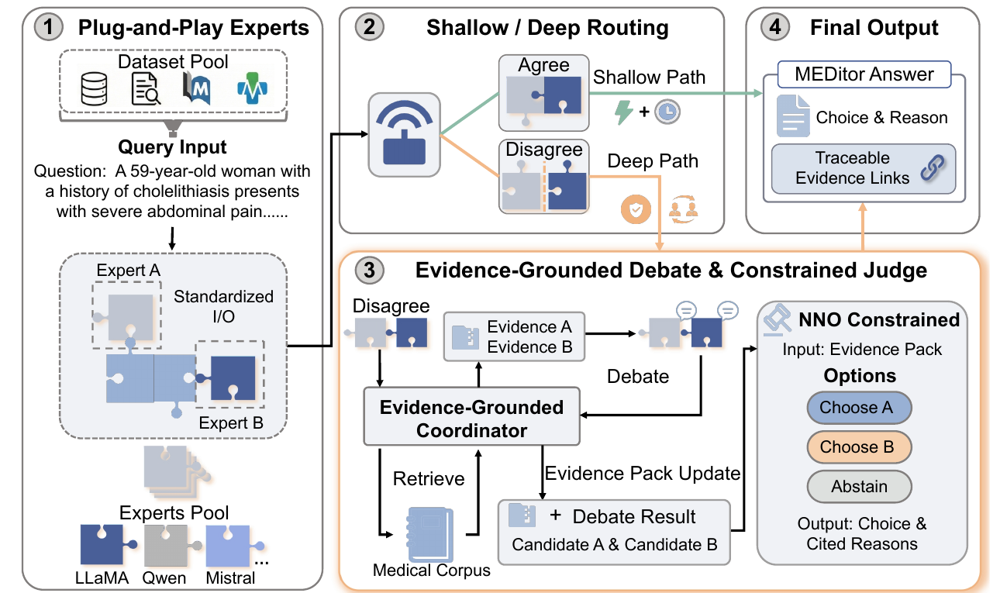

# [EMNLP 2026] MEDitor: A Plug-and-Play Medical Multi-Agent Routing Protocol

<p align="center">
  <strong>Official camera-ready implementation of MEDitor</strong>
</p>

<p align="center">
  
  
  <a href="https://github.com/100120023003/MEDitor-code/releases/tag/v0.1.0"></a>
  <a href="https://github.com/100120023003/MEDitor-code/actions/workflows/ci.yml"></a>
  <a href="LICENSE"></a>
  <a href="pyproject.toml"></a>
</p>

**TL;DR:** MEDitor is a training-free routing protocol that lets two
interchangeable medical experts answer easy questions quickly and escalates only
their disagreements to an evidence-grounded, candidate-constrained deep path.
Across four medical QA benchmarks, MEDitor reaches **78.03% average accuracy**
while invoking the deep path for only **23.8%-55.1%** of questions.

<p align="center">
  
</p>

## Highlights

- **Plug-and-play experts.** Heterogeneous medical LLMs share a standardized
  input/output contract and can be replaced without retraining the router.
- **Disagreement-triggered routing.** Agreement cases exit through the shallow
  path; only contested cases pay for retrieval, debate, and judging.
- **Evidence-grounded arbitration.** The coordinator builds option-aligned
  evidence packs instead of answering the question directly.
- **No-New-Option (NNO) constraint.** The judge can select only an
  expert-proposed candidate or abstain, preventing answer drift.
- **Traceable and reproducible decisions.** Evidence references, judge traces,
  and a deterministic abstention fallback make deep-path decisions auditable.

> [!IMPORTANT]
> MEDitor is research software, not a medical device. Its outputs must not be
> used for diagnosis, treatment, or other clinical decisions.

## News

- **2026-08-21:** Released the public camera-ready code and
  [`v0.1.0`](https://github.com/100120023003/MEDitor-code/releases/tag/v0.1.0).
- **2026:** MEDitor was accepted to EMNLP Findings 2026. The public paper link and
  archival BibTeX will be added when the proceedings metadata is available.

## Results

Exact-match accuracy (%) from Table 1 of the paper:

| Method | MedQA | PubMedQA | MedMCQA | MMLU-med | Average |
| --- | ---: | ---: | ---: | ---: | ---: |
| UltraMedical-7B | 74.07 | 75.20 | 63.16 | 70.98 | 70.85 |
| Huatuo-8B | 78.95 | 77.80 | 60.38 | 77.81 | 73.73 |
| Llama-3.1-70B-Instruct | 79.42 | 77.84 | 71.83 | 79.89 | 77.24 |
| Two-expert baseline | 78.01 | 76.50 | 61.77 | 74.39 | 72.66 |
| Debate only | 79.41 | 78.80 | 64.18 | 78.77 | 75.29 |
| Judge only | 78.94 | 77.80 | 64.92 | 79.34 | 75.25 |
| **MEDitor** | **82.46** | **82.20** | **66.12** | **81.34** | **78.03** |

MEDitor matches or exceeds the representative 70B baseline on MedQA,
PubMedQA, and MMLU-med. Its expensive deep path scales with expert
disagreement rather than dataset size:

| Benchmark | Evaluation examples | Deep-path calls |
| --- | ---: | ---: |
| MedQA | 1,273 | 26.1% |
| PubMedQA | 500 | 23.8% |
| MedMCQA | 4,183 | 32.2% |
| MMLU-med | 1,089 | 55.1% |

These values reproduce Tables 1 and 2 of the camera-ready manuscript. Model
weights, benchmark data, retrieval corpora, indexes, and generated traces are
not redistributed; obtain them from their official sources and follow their
licenses.

### Paper Configuration

| Role | Model |
| --- | --- |
| Expert A | UltraMedical-8B |
| Expert B | Huatuo-8B |
| Coordinator | Llama-3.1-8B-Instruct |
| Judge | Prometheus-7B |

The implementation accepts any OpenAI-compatible chat-completions endpoint.
The paper also evaluates a Qwen3-8B and Meerkat-8B expert pair.

## Quick Start

Python 3.10 or 3.11 is recommended.

```bash
git clone https://github.com/100120023003/MEDitor-code.git
cd MEDitor-code
python -m venv .venv
source .venv/bin/activate
python -m pip install --upgrade pip
python -m pip install -e .
```

On Windows PowerShell, activate the environment with:

```powershell
.\.venv\Scripts\Activate.ps1
```

Run the dependency-light smoke test below. It makes no model or network calls:
both expert predictions are read from the included cache and take the shallow
path.

```bash
python -m meditor.runner \
  --data examples/example_input.jsonl \
  --run-dir outputs/smoke \
  --a-base http://127.0.0.1:8602/v1 --a-model unused-expert-a \
  --b-base http://127.0.0.1:8603/v1 --b-model unused-expert-b \
  --a-baseline-preds examples/expert_a_predictions.jsonl \
  --b-baseline-preds examples/expert_b_predictions.jsonl \
  --disable-debate --no-llm-judge
```

On PowerShell, replace each trailing `\` with a backtick, or put the command on
one line.

## Installation Options

The base install is sufficient for remote OpenAI-compatible endpoints and the
cached-prediction smoke test. For local MedRAG retrieval, install:

```bash
python -m pip install -e ".[retrieval]"
```

Install the CUDA-specific PyTorch build required by your hardware before the
retrieval extra when applicable. Pyserini-based sparse retrieval also requires
a working Java installation.

### Custom Textbook Indexes

MEDitor includes a self-contained BM25/dense indexing path for owned or
properly licensed textbook corpora. Convert source material to the
[documented corpus format](meditor/custom_rag/corpus_format.md), then build the
indexes:

```bash
meditor-rag build-bm25 \
  --chunks /path/to/corpus/chunks.jsonl \
  --index_dir /path/to/corpus/indexes/bm25

meditor-rag build-dense \
  --chunks /path/to/corpus/chunks.jsonl \
  --index_dir /path/to/corpus/indexes/medcpt \
  --model_name ncbi/MedCPT-Article-Encoder \
  --query_model_name ncbi/MedCPT-Query-Encoder \
  --device cuda:0
```

Select those indexes in the main runner with
`--custom-rag-textbooks-corpus-dir /path/to/corpus`. Use only corpora whose
licenses permit this processing.

## Run MEDitor

Start OpenAI-compatible servers for the two experts and judge, then run:

```bash
python -m meditor.runner \
  --data /path/to/test.jsonl \
  --run-dir outputs/experiment_name \
  --a-base http://127.0.0.1:8602/v1 --a-model expert-a \
  --b-base http://127.0.0.1:8603/v1 --b-model expert-b \
  --j-base http://127.0.0.1:8605/v1 --j-model judge \
  --use-medrag-judge \
  --remote-rag-base http://127.0.0.1:8604/v1 \
  --remote-rag-model rag-coordinator
```

`--use-medrag-judge` enables the evidence coordinator. The example above uses
a complete remote RAG service. For the bundled local retrieval backend, replace
the remote RAG arguments with:

```bash
--medrag-mode rag_textbooks \
--medrag-llm-name /path/to/coordinator_model \
--medrag-corpus-dir /path/to/medrag_corpus
```

Run `python -m meditor.runner --help` for all routing, retrieval, debate, judge,
and ablation options.

### Endpoint Authentication

Local endpoints need no key. Authenticated endpoints can use command-line
arguments or these environment variables:

| Role | Argument | Environment variable |
| --- | --- | --- |
| Expert A | `--a-api-key` | `MEDITOR_A_API_KEY` |
| Expert B | `--b-api-key` | `MEDITOR_B_API_KEY` |
| Judge | `--j-api-key` | `MEDITOR_JUDGE_API_KEY` |
| Optional solver | `--solver-api-key` | `MEDITOR_SOLVER_API_KEY` |
| RAG summarizer | `--rag-summary-api-key` | `RAG_API_KEY` |
| Remote RAG | `--remote-rag-api-key` | `REMOTE_RAG_API_KEY` |

Prefer environment variables so credentials do not appear in shell history.
Never commit `.env` files.

## Data and Outputs

The default loader expects one JSON object per line:

```json
{"id":"case-001","question":"Question text","options":{"A":"first","B":"second","C":"third","D":"fourth"},"gold":"B"}
```

`options` may also be a list. Gold labels may be supplied as `gold_letter`,
`gold`, `label`, `answer`, `answer_idx`, or `label_idx`. To use the separate
input/label format supported by the unified benchmarks, pass
`--labels /path/to/labels.jsonl`.

Cached expert files use one record per line:

```json
{"id":"case-001","pred":"B"}
```

The cache loader also accepts `uid`/`idx` keys and common prediction field
names. Each run writes:

| Output | Description |
| --- | --- |
| `preds.jsonl` | Predictions, routing decisions, and per-case metadata |
| `judge_traces.jsonl` | Judge inputs and outputs when judging is enabled |
| `run_summary.md` | Aggregate accuracy and routing statistics |
| `md/` | Optional readable traces produced by `--md-all` |
| `medrag/` | Retrieval logs when the evidence coordinator is enabled |

Do not publish raw benchmark questions, licensed corpora, or private model
traces unless their licenses and data-governance rules permit it.

## Repository Structure

| Path | Purpose |
| --- | --- |
| `meditor/runner.py` | Main agreement-aware routing and evaluation entry point |
| `meditor/coordinator_medrag.py` | Evidence-grounded coordinator |
| `meditor/agents.py` | OpenAI-compatible endpoint client |
| `meditor/voting.py` | Self-consistency voting |
| `meditor/debate.py` | Optional disagreement debate |
| `meditor/judge.py` | Candidate-constrained pairwise judge |
| `meditor/router.py` | Shallow/deep routing policy |
| `meditor/medqa.py`, `meditor/bench_io.py` | Input parsers |
| `meditor/medrag_src/` | Adapted MedRAG retrieval backend |
| `meditor/custom_rag/` | Custom corpus import and hybrid indexing utilities |
| `examples/` | Public example input and cached predictions |
| `tests/` | Dependency-light release tests |

## Tests

```bash
python -m unittest discover -s tests -v
```

The test suite checks input parsing, routing decisions, endpoint configuration,
BM25 index round-tripping, and an end-to-end cached-prediction run without
heavyweight dependencies.

## Citation

Please cite the EMNLP 2026 paper **"MEDitor: A Plug-and-Play Medical
Multi-Agent Routing Protocol."** The paper link and archival ACL Anthology
BibTeX entry will be added here once the proceedings record is public.

## Acknowledgements

The retrieval backend in `meditor/medrag_src/` is adapted from
[MedRAG](https://github.com/gzxiong/MedRAG). Its United States Government Work
notice and requested attribution are retained in
[`meditor/medrag_src/LICENSE`](meditor/medrag_src/LICENSE). See
[`THIRD_PARTY_NOTICES.md`](THIRD_PARTY_NOTICES.md) for details.

## License

MEDitor-specific code is released under the [MIT License](LICENSE). The adapted
MedRAG files retain the upstream public-domain notice described above.
